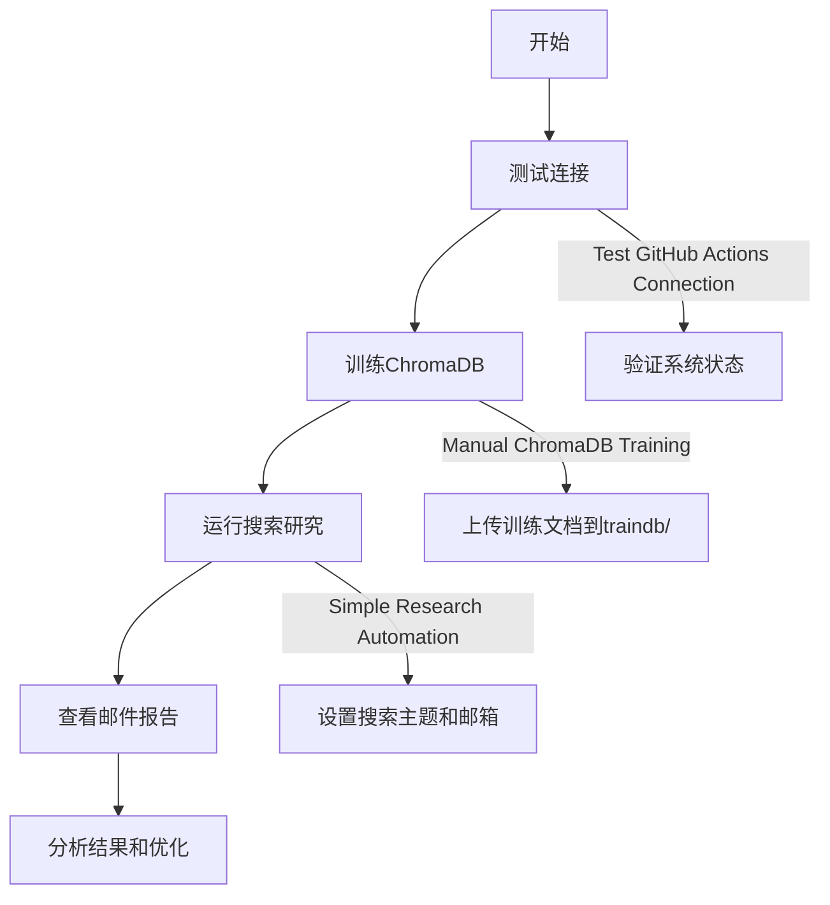
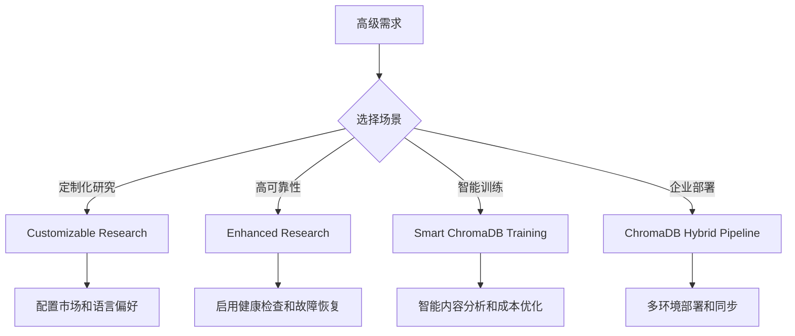

# 征信研究自动化系统 (Credit Research Automation)


一个基于AI的征信行业研究自动化系统，集成Perplexity搜索、千问API向量化、ChromaDB向量数据库和智能邮件推送功能。

## 🎯 核心功能

- **🔍 智能搜索**: 使用Perplexity API进行专业的征信研究内容搜索
- **🧮 向量化处理**: 千问API文本向量化和语义分析
- **📊 向量数据库**: ChromaDB训练和相似度匹配
- **📧 自动推送**: 智能邮件报告生成和发送
- **🔒 Token监控**: 实时API使用监控和成本控制
- **🔄 模型一致性**: 完整的向量模型版本管理

## 🚀 GitHub Actions Workflows 详解

### 🎯 **核心研究Workflows**

#### 1. **Simple Research Automation** 
[](../../actions/workflows/simple-research.yml)

**用途**: 主要的端到端研究自动化流程

**功能流程**:
```
Perplexity搜索 → 文本切分 → 千问向量化 → ChromaDB比对 → 邮件报告
```

**适用场景**:
- 日常征信研究需求
- 定期行业动态跟踪
- 快速获取相关研究资料

**参数配置**:
- `search_topics`: 搜索主题（如：征信风险管理,个人征信技术创新）
- `email_recipients`: 邮件接收者
- `time_filter`: 搜索时间范围（week/month/year）
- `perplexity_token_limit`: Perplexity API Token限制（默认55000）
- `qwen_token_limit`: 千问 API Token限制（默认600000）

---

#### 2. **Customizable Research Automation**
[](../../actions/workflows/customizable-research.yml)

**用途**: 高度自定义的研究自动化

**特色功能**:
- 🌍 **市场焦点选择**: 中国市场/全球市场/新兴市场
- 📊 **内容深度配置**: 概览性/深入分析/技术详解
- 🎯 **搜索重点**: 政策导向/技术创新/市场分析
- 🗣️ **语言偏好**: 中文优先/英文优先/多语言

**适用场景**:
- 特定市场或地区的研究
- 不同深度的分析需求
- 多语言研究报告生成

---

#### 3. **Enhanced Research with API Health Check**
[](../../actions/workflows/enhanced-research.yml)

**用途**: 带健康检查的增强研究流程

**增强功能**:
- 🏥 **API健康检查**: 预检查所有API服务状态
- 🔄 **自动故障恢复**: API失败时的自动重试机制
- 📈 **性能监控**: 详细的执行时间和成功率统计
- 🛡️ **错误处理**: 完善的异常捕获和降级策略

**适用场景**:
- 重要的研究任务
- 需要高可靠性的场景
- API服务不稳定时的备选方案

---

### 🎓 **ChromaDB训练Workflows**

#### 4. **Manual ChromaDB Training**
[](../../actions/workflows/manual-chromadb-training.yml)

**用途**: 手动管理ChromaDB向量数据库训练

**核心功能**:
- 📂 **文件管理**: 基于`traindb/`文件夹的训练数据管理
- 🔄 **增量训练**: 只处理新增或修改的文件
- 🧹 **去重处理**: 自动检测和跳过重复内容
- 📊 **Token估算**: 训练前Token消耗预估和用户确认
- 🔍 **实时监控**: 训练过程中的Token使用监控

**训练模式**:
- `incremental`: 增量训练（推荐）
- `full_retrain`: 完全重训练
- `stats_only`: 仅查看统计信息

**适用场景**:
- 新增征信研究文档
- 更新已有知识库
- 定期数据库维护

---

#### 5. **Smart ChromaDB Training with Progress**
[](../../actions/workflows/smart-chromadb-training.yml)

**用途**: 智能化的ChromaDB训练系统

**智能特性**:
- 🧠 **智能分析**: 自动分析文件类型和内容质量
- 📊 **进度可视化**: 实时进度条和详细统计
- 💰 **成本评估**: 精确的Token消耗计算和成本预估
- 🤖 **自动决策**: 基于内容质量的智能训练策略

**训练策略**:
- `estimate`: 仅进行Token消耗估算
- `auto`: 自动训练（小于阈值时）
- `force`: 强制训练（忽略成本限制）

---

#### 6. **ChromaDB Hybrid Pipeline**
[](../../actions/workflows/chromadb-hybrid-pipeline.yml)

**用途**: 混合架构的ChromaDB管理流水线

**架构特色**:
- 🏠 **本地+云端**: 本地开发，云端部署的混合架构
- 📡 **自动同步**: 本地训练数据自动同步到云端
- 🔄 **版本管理**: 完整的数据库版本控制和回滚
- 🌐 **多环境支持**: 开发、测试、生产环境隔离

**适用场景**:
- 企业级部署
- 多环境数据同步
- 大规模向量数据管理

---

### 🛠️ **系统维护Workflows**

#### 7. **Test GitHub Actions Connection**
[](../../actions/workflows/test-connection.yml)

**用途**: GitHub Actions系统连接测试

**检测功能**:
- 🔍 **环境检查**: 验证运行环境和依赖
- 📁 **文件统计**: 统计workflow文件数量和大小
- 🔗 **连接测试**: 验证GitHub Actions服务状态
- 📊 **系统报告**: 生成详细的系统状态报告

**使用时机**:
- 新环境部署后的验证
- 系统异常时的诊断
- 定期健康检查

---

#### 8. **Credit Research Automation (CI)**
[](../../actions/workflows/ci.yml)

**用途**: 持续集成和代码质量检查

**CI流程**:
- ✅ **代码检查**: 语法和格式验证
- 🧪 **单元测试**: 核心功能测试
- 📦 **依赖检查**: 第三方库安全性扫描
- 🔒 **安全审计**: 代码安全漏洞检测

---

### 🌐 **API服务Workflows**

#### 9. **Credit Research API Automation**
[](../../actions/workflows/research-api.yml)

**用途**: RESTful API服务自动化

**API功能**:
- 🚀 **FastAPI服务**: 高性能异步API服务
- 📚 **接口文档**: 自动生成API文档
- 🔒 **认证授权**: API密钥和权限管理
- 📊 **监控日志**: 详细的API调用统计

---

#### 10. **Self-Hosted API Research Automation**
[](../../actions/workflows/self-hosted-api.yml)

**用途**: 私有部署的API研究服务

**部署特色**:
- 🏠 **私有化部署**: 完全自主控制的API服务
- 🔐 **数据安全**: 敏感数据不出本地环境
- ⚡ **高性能**: 针对私有环境优化的性能配置
- 🛠️ **定制化**: 支持企业特定需求的定制开发

---

## 📊 推荐使用流程

### 🚀 **快速开始流程**



### 📈 **进阶使用流程**



## 🔧 系统要求

### **必需的GitHub Secrets**
```env
# API密钥
PERPLEXITY_API_KEY=your_perplexity_api_key
QWEN_API_KEY=your_qwen_api_key

# 邮件配置
SMTP_SERVER=smtp.qq.com
SMTP_PORT=587
SMTP_USER=your_email@qq.com
SMTP_PASSWORD=your_app_password
```

### **可选配置**
```env
# API替代密钥
DEEPSEEK_API_KEY=your_deepseek_api_key

# 高级邮件配置
SMTP_USE_TLS=true
SMTP_TIMEOUT=30
```

## 📝 使用示例

### 基础研究任务
```yaml
# Simple Research Automation 参数示例
search_topics: "征信风险管理,个人征信技术创新,征信法规政策"
email_recipients: "researcher@company.com"
time_filter: "week"
```

### 定制化研究任务
```yaml
# Customizable Research 参数示例
market_focus: "china_market"
content_depth: "detailed_analysis"
search_emphasis: "technology_innovation"
language_preference: "chinese_priority"
```

### ChromaDB训练任务
```yaml
# Manual ChromaDB Training 参数示例
training_mode: "incremental"
cleanup_after_training: false
token_multiplier: "1.5"
```

## 🎯 最佳实践

### 1. **Token成本管理**
- 设置合理的Token限制（建议$0.5-2.0范围）
- 使用增量训练减少重复消耗
- 定期清理无用的训练数据

### 2. **数据质量优化**
- 上传高质量的征信研究文档到`traindb/`
- 保持文档格式的一致性
- 定期更新过时的研究资料

### 3. **工作流选择策略**
- 日常使用：**Simple Research Automation**
- 特殊需求：**Customizable Research**
- 重要任务：**Enhanced Research**
- 数据更新：**Manual ChromaDB Training**

## 📈 系统监控

### **Token使用统计**
- 实时Token消耗监控
- 历史使用趋势分析
- 成本预警和限制

### **API性能监控**
- 响应时间统计
- 成功率监控
- 错误类型分析

### **数据质量评估**
- 搜索结果相关性评分
- 向量匹配准确度
- 用户满意度反馈

## 📁 项目结构

```
creditmonitor/
├── 📂 oop/                    # 面向对象核心模块
│   ├── main.py               # 主程序入口
│   ├── config.py             # 配置管理
│   ├── model_manager.py      # 🆕 统一模型管理器
│   ├── search_result_processor.py  # 🆕 搜索结果处理器
│   └── component_manager.py  # 组件管理器
├── 📂 api/                    # RESTful API服务
│   ├── app/                  # FastAPI应用
│   │   ├── main.py          # API主应用
│   │   ├── routers/         # API路由 (search, vector, email, research)
│   │   ├── models/          # 数据模型 (Pydantic)
│   │   └── core/            # 核心配置
│   └── requirements.txt     # API依赖
├── 📂 .github/               # GitHub Actions工作流
│   └── workflows/           # 自动化工作流定义
│       ├── simple-research.yml      # 🎯 主要研究流程
│       ├── unified_search.yml     # 🆕 聚合分析模板
│       ├── unified-training.yml     # 🆕 统一训练流程
│       └── unified-deployment.yml   # 🆕 统一部署流程
├── 📂 tests/ 🆕             # 测试文件夹
│   ├── test_*.py            # 功能测试脚本
│   ├── validate_*.py        # 验证脚本
│   ├── cleanup_*.py         # 清理工具脚本
│   └── README.md            # 测试文档
├── 📂 docs/ 🆕              # 文档中心
│   ├── *_COMPLETE.md        # 功能实现总结
│   ├── *_ANALYSIS.md        # 分析报告
│   ├── *_GUIDE.md           # 使用指南
│   └── README.md            # 文档索引
├── 📂 scripts/              # 独立脚本
│   ├── search_perplexity.py # Perplexity搜索脚本
│   ├── test_apis.py         # API测试脚本
│   └── vector_embedding.py  # 向量化脚本
├── 📂 production_package/   # 生产环境打包
├── 📂 legacy_workflows_backup/  # 旧工作流备份
├── 📂 traindb/              # ChromaDB训练数据
└── 📄 requirements.txt      # 核心依赖包列表
```

### 🆕 新增文件夹说明

- **`tests/`**: 集中管理所有测试脚本、验证工具和清理脚本
- **`docs/`**: 存放开发过程中的所有文档、分析报告和使用指南
- **核心优化**: 统一模型管理器、搜索结果处理器、工作流整合

## 🤝 贡献指南

欢迎提交Issue和Pull Request来改进系统！

### 开发环境设置
```bash
# 克隆仓库
git clone https://github.com/YefanHuang/creditmonitor.git

# 安装依赖
pip install -r requirements.txt

# 运行测试
python tests/test_fastapi_startup.py
python tests/test_enhanced_search_processing.py
```

## 📄 许可证

MIT License - 详见 [LICENSE](LICENSE) 文件

---

## 🚀 快速开始

1. **配置GitHub Secrets** (必需)
2. **运行** [Test GitHub Actions Connection](../../actions/workflows/test-connection.yml) 验证环境
3. **上传训练数据到** `traindb/` 文件夹
4. **运行** [Manual ChromaDB Training](../../actions/workflows/manual-chromadb-training.yml) 训练数据库
5. **运行** [Simple Research Automation](../../actions/workflows/simple-research.yml) 开始研究

**🎯 立即开始您的征信研究自动化之旅！**