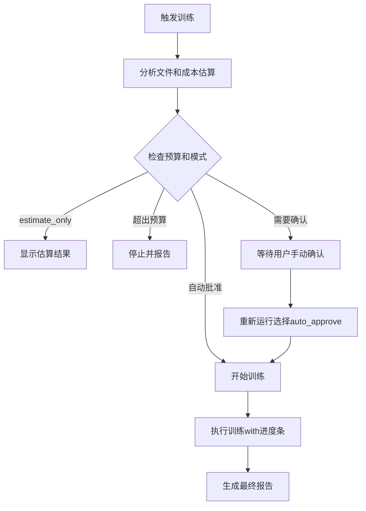

# 智能ChromaDB训练器演示

## 🎯 新功能概览

### ✨ 主要特性
- 📊 **成本预估**: 训练前预估token消耗和费用
- 🎛️ **用户确认**: 支持手动确认或自动批准
- 📈 **实时进度**: 文件处理和token消耗进度条
- 💰 **预算控制**: 设置token预算上限防止超支
- 🔍 **智能分析**: 详细的文件分析和跳过逻辑

## 🚀 GitHub Actions工作流

### 工作流程图


### 使用示例

#### 1. 仅估算成本模式
```yaml
# 选择参数
training_mode: estimate_only
auto_approve: false
max_token_budget: 100000
```

**输出示例**:
```
📊 文件分析结果:
   总文件数: 5
   待处理文件: 3
   跳过文件: 2
   预估tokens: 15,234

💰 成本估算:
   文本切分: ¥0.0152
   向量化: ¥0.0076
   总成本: ¥0.0228 (≈$0.0032)

📁 待处理文件:
   - 征信监管新政.txt (5,234 tokens)
   - ESG评级指南.md (7,890 tokens)
   - 金融科技报告.txt (2,110 tokens)
```

#### 2. 手动确认模式
```yaml
# 选择参数
training_mode: incremental
auto_approve: false
max_token_budget: 50000
```

**流程**:
1. 系统分析文件并估算成本
2. 显示详细的成本分析
3. 工作流暂停，提示用户确认
4. 用户重新运行选择`auto_approve: true`继续

#### 3. 自动批准模式
```yaml
# 选择参数  
training_mode: incremental
auto_approve: true
max_token_budget: 100000
```

**特点**:
- 跳过手动确认步骤
- 直接执行训练
- 实时显示进度条

## 📈 本地训练器使用

### 安装依赖
```bash
pip install tiktoken aiofiles
```

### 使用方式

#### 1. 基本使用
```bash
# 交互式训练（会提示确认）
python smart_chromadb_trainer.py

# 输出示例：
🎯 智能ChromaDB训练器启动
==================================================
📊 分析traindb文件夹...
📋 已处理文件数量: 2
🔍 分析 5 个文件...
文件分析: |██████████████████████████████████████████████████| 100.0% (5/5)

📊 文件分析结果:
   总文件数: 5
   待处理文件: 3
   跳过文件: 2
   预估tokens: 15,234

💰 成本估算:
   文本切分: ¥0.0152
   向量化: ¥0.0076
   总成本: ¥0.0228 (≈$0.0032)

🤔 请确认训练参数:
   文件数量: 3
   预估tokens: 15,234
   预估成本: ¥0.0228
   API调用预估: 6 次

是否继续训练? (y/N):
```

#### 2. 自动批准模式
```bash
# 跳过确认，直接训练
python smart_chromadb_trainer.py --auto
```

#### 3. 强制重训模式
```bash
# 重新处理所有文件（包括已处理的）
python smart_chromadb_trainer.py --force
```

#### 4. 仅估算模式
```bash
# 只查看成本估算，不执行训练
python smart_chromadb_trainer.py --estimate
```

### 进度条展示

#### 训练过程示例
```
🚀 开始执行训练...
📊 训练概况:
   文件数量: 3
   预估tokens: 15,234

🔄 开始处理文件:

📄 [1/3] 处理: 征信监管新政.txt
   🔧 步骤1/2: 文本切分...
   ✅ 生成 8 个文档块
   🔧 步骤2/2: 生成向量...
   ✅ 生成 8 个向量

文件进度: |████████████████▒▒▒▒▒▒▒▒▒▒▒▒▒▒▒▒▒▒▒▒▒▒▒▒▒▒▒▒▒▒▒▒▒▒| 33.3% (1/3) ETA: 45s
Token进度: |██████████████████▒▒▒▒▒▒▒▒▒▒▒▒▒▒▒▒▒▒▒▒▒▒▒▒▒▒▒▒▒▒▒▒| 34.4% (5,234/15,234) ETA: 42s

📄 [2/3] 处理: ESG评级指南.md
   🔧 步骤1/2: 文本切分...
   ✅ 生成 12 个文档块
   🔧 步骤2/2: 生成向量...
   ✅ 生成 12 个向量

文件进度: |████████████████████████████████▒▒▒▒▒▒▒▒▒▒▒▒▒▒▒▒▒▒| 66.7% (2/3) ETA: 23s
Token进度: |████████████████████████████████████████▒▒▒▒▒▒▒▒▒▒| 86.1% (13,124/15,234) ETA: 12s

📄 [3/3] 处理: 金融科技报告.txt
   🔧 步骤1/2: 文本切分...
   ✅ 生成 4 个文档块
   🔧 步骤2/2: 生成向量...
   ✅ 生成 4 个向量

文件进度: |██████████████████████████████████████████████████| 100.0% (3/3)
Token进度: |██████████████████████████████████████████████████| 100.0% (15,234/15,234)

🎉 训练完成!
   版本: smart_v20240101_143022
   处理文件: 3
   生成块: 24
   API调用: 6
   实际tokens: 15,234
   预估准确度: 100.0%
```

## 💰 成本控制机制

### 预算设置
```bash
# 设置最大50,000 tokens预算
python smart_chromadb_trainer.py --max-budget 50000
```

### 预算超限处理
```
💰 预算超限:
   预估tokens: 75,234
   预算上限: 50,000
   超出: 25,234 tokens

❌ 为了控制成本，训练已停止
💡 建议：
   1. 增加预算限制
   2. 减少训练文件数量
   3. 分批次训练
```

## 🔍 智能文件分析

### 跳过逻辑
- ✅ **已处理文件**: 根据内容哈希跳过
- ✅ **空文件**: 自动跳过无内容文件
- ✅ **读取失败**: 跳过无法读取的文件

### 分析报告示例
```
📊 文件分析结果:
   总文件数: 8
   待处理文件: 3
   跳过文件: 5
   预估tokens: 25,678

📁 待处理文件:
   - 新文档1.txt (8,234 tokens)
   - 新文档2.md (12,890 tokens)
   - 更新文档.txt (4,554 tokens)

⏭️ 跳过的文件:
   - 旧文档1.txt (已处理)
   - 旧文档2.md (已处理)
   - 空文档.txt (内容为空)
   - 损坏文档.pdf (读取失败: 文件损坏)
   - 大文档.docx (读取失败: 需要实现DOCX解析)
```

## 🎛️ GitHub Actions配置选项

### 输入参数说明

| 参数 | 类型 | 默认值 | 说明 |
|------|------|--------|------|
| `training_mode` | choice | incremental | 训练模式选择 |
| `auto_approve` | boolean | false | 是否自动批准训练 |
| `max_token_budget` | string | 100000 | 最大token预算 |

### 训练模式详解

#### `incremental` - 增量训练
- 只处理新文件或内容变更的文件
- 基于文件哈希智能去重
- 推荐日常使用

#### `full_retrain` - 完全重训
- 重新处理所有文件
- 忽略之前的处理记录
- 用于模型升级或数据重建

#### `estimate_only` - 仅估算
- 分析文件但不执行训练
- 显示详细的成本预估
- 用于预算规划

## 📊 输出结果

### GitHub Actions输出
```yaml
outputs:
  has_files: "true"
  file_count: "3"
  estimated_tokens: "15234"
  estimated_cost: '{"total_cost_cny": 0.0228}'
  chromadb_version: "smart_v20240101_143022"
  training_result: '{"status": "success", "processed_files": 3}'
```

### 本地输出文件
- `traindb/.training_state.json` - 训练状态记录
- `chromadb_output_*/` - 生成的向量数据库
- 控制台实时进度显示

## 🔄 最佳实践

### 1. 成本控制
```bash
# 先估算成本
python smart_chromadb_trainer.py --estimate

# 确认后执行
python smart_chromadb_trainer.py --auto
```

### 2. 批量处理
```bash
# 设置合理的预算
python smart_chromadb_trainer.py --auto --max-budget 200000
```

### 3. 增量更新
```bash
# 定期增量训练
python smart_chromadb_trainer.py --auto  # 只处理新文件
```

### 4. 紧急重建
```bash
# 完全重建数据库
python smart_chromadb_trainer.py --force --auto
```

## 🚨 注意事项

1. **API配额**: 注意千问API的调用限制
2. **成本控制**: 建议设置合理的预算上限
3. **文件管理**: 定期清理不需要的文件
4. **状态备份**: 重要时刻备份`.training_state.json`

---

**🎉 现在您可以精确控制训练成本，实时监控进度，让ChromaDB训练变得智能可控！**
 
 
 