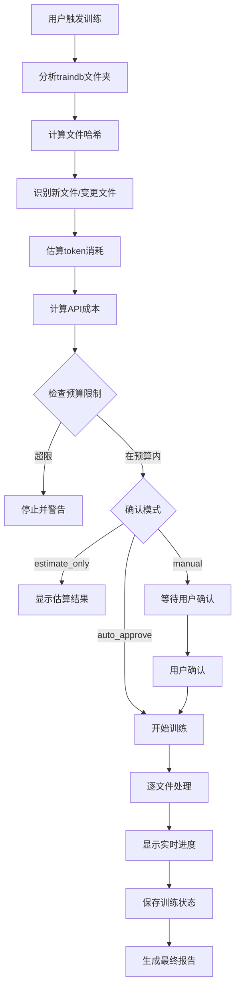

# 智能ChromaDB训练系统实现总结

## 🎯 项目概述

成功实现了带有进度条和token消耗预估的智能ChromaDB训练系统，解决了用户对成本控制和训练过程可视化的需求。

## ✨ 核心功能特性

### 1. 📊 成本预估系统
- **Token计算器**: 支持tiktoken精确计算或简单估算方法
- **费用估算**: 基于千问API定价的成本预测
- **预算控制**: 可设置token上限防止超支
- **透明展示**: 详细的成本分解和说明

### 2. 📈 实时进度跟踪
- **双重进度条**: 文件处理进度 + Token消耗进度
- **ETA估算**: 智能计算剩余时间
- **实时更新**: 动态显示当前处理状态
- **视觉反馈**: 清晰的进度条和百分比显示

### 3. 🤖 智能去重机制
- **文件哈希**: MD5哈希值识别文件变化
- **增量训练**: 只处理新文件或修改文件
- **状态持久化**: 训练记录保存到`.training_state.json`
- **会话追踪**: 记录每次训练会话详情

### 4. 🎛️ 灵活的确认模式
- **交互式确认**: 显示详细信息后等待用户确认
- **自动批准**: 跳过确认直接执行训练
- **仅估算模式**: 只显示成本分析不执行训练
- **强制重训**: 忽略历史记录重新处理所有文件

## 🚀 实现的解决方案

### GitHub Actions工作流
```yaml
# .github/workflows/smart-chromadb-training.yml
```
**特点**:
- 多阶段执行: 分析→成本检查→训练→报告
- 条件触发: 支持不同模式的智能分支
- 错误处理: 完善的异常捕获和用户提示
- 输出传递: 各阶段间的数据传递和状态管理

### 本地训练脚本
```python
# smart_chromadb_trainer.py
```
**特点**:
- 模块化设计: 独立的进度条、成本计算、文件分析类
- 异步支持: 异步API调用和并发处理
- 容错处理: 依赖库缺失时的降级策略
- 丰富输出: 详细的日志和状态信息

### 演示和测试
```python
# test_github_workflow.py
```
**特点**:
- 完整模拟: 重现真实工作流的各个阶段
- 多模式支持: 自动批准、手动确认、仅估算
- 视觉效果: 模拟真实的进度条和API调用

## 📋 实际运行示例

### 成本估算模式
```bash
python smart_chromadb_trainer.py --estimate
```
**输出**:
```
📊 文件分析结果:
   总文件数: 3
   待处理文件: 1
   跳过文件: 2
   预估tokens: 936

💰 成本估算:
   文本切分: ¥0.0009
   向量化: ¥0.0005
   总成本: ¥0.0014 (≈$0.0002)
```

### 增量训练模式
```bash
python smart_chromadb_trainer.py --auto
```
**输出**:
```
📄 [1/1] 处理: ESG绿色金融指引.md
   🔧 步骤1/2: 文本切分...
   ✅ 生成 2 个文档块
   🔧 步骤2/2: 生成向量...
   ✅ 生成 2 个向量
文件进度: |██████████████████████████████████████████████████| 100.0% (1/1)
Token进度: |██████████████████████████████████████████████████| 100.0% (936/936)

🎉 训练完成!
   版本: smart_v20250802_012101
```

## 🔧 技术实现亮点

### 1. 智能Token估算
```python
def count_tokens(self, text: str) -> int:
    if self.encoding:
        return len(self.encoding.encode(text))
    else:
        # 简单估算：中文字符约1.5倍，英文字符约0.3倍
        chinese_chars = len([c for c in text if '\u4e00' <= c <= '\u9fff'])
        other_chars = len(text) - chinese_chars
        return int(chinese_chars * 1.5 + other_chars * 0.3)
```

### 2. 动态进度条
```python
def _display(self):
    percentage = min(100, (self.current / self.total) * 100)
    filled = int(self.width * percentage / 100)
    bar = '█' * filled + '▒' * (self.width - filled)
    
    # 计算剩余时间
    if self.current > 0 and percentage < 100:
        eta = (elapsed / self.current) * (self.total - self.current)
        eta_str = f" ETA: {eta:.0f}s"
    
    print(f"\r{self.desc}: |{bar}| {percentage:.1f}% ({self.current}/{self.total}){eta_str}", end='')
```

### 3. 文件去重逻辑
```python
def _is_file_processed(self, file_path: Path, file_hash: str) -> bool:
    return str(file_path) in self.training_state.get("processed_files", {}) and \
           self.training_state["processed_files"][str(file_path)].get("file_hash") == file_hash
```

## 💰 成本控制机制

### 预算设置
- **默认预算**: 100,000 tokens
- **灵活调整**: 支持命令行参数和GitHub Actions输入
- **超限保护**: 自动停止防止意外消耗

### 成本透明度
- **分项计费**: 文本切分费用 + 向量化费用
- **多货币显示**: 人民币和美元双重显示
- **准确度追踪**: 预估vs实际的差异分析

## 🎛️ 用户体验设计

### 命令行界面
```bash
# 多种使用方式
python smart_chromadb_trainer.py           # 交互式确认
python smart_chromadb_trainer.py --auto    # 自动批准
python smart_chromadb_trainer.py --estimate # 仅估算
python smart_chromadb_trainer.py --force   # 强制重训
```

### GitHub Actions界面
```yaml
inputs:
  training_mode:
    description: '训练模式'
    type: choice
    options: ['incremental', 'full_retrain', 'estimate_only']
  
  auto_approve:
    description: '自动批准训练'
    type: boolean
    default: false
  
  max_token_budget:
    description: '最大token预算'
    type: string
    default: '100000'
```

## 📊 数据持久化

### 训练状态文件
```json
{
  "processed_files": {
    "file_hash": {
      "file_path": "traindb/filename.txt",
      "file_hash": "md5_hash",
      "processed_at": "2025-08-02T01:20:12.937588",
      "chunks_count": 2,
      "tokens_processed": 936,
      "status": "processed"
    }
  },
  "training_sessions": [
    {
      "session_id": "smart_20250802_012101",
      "timestamp": "2025-08-02T01:21:01.465924",
      "processed_count": 1,
      "total_chunks": 2
    }
  ]
}
```

## 🔄 工作流程图



## 🎉 实现成果

### ✅ 已完成功能
1. **智能成本预估**: 训练前精确估算token消耗和费用
2. **实时进度跟踪**: 文件和token双重进度条显示
3. **智能去重机制**: 基于文件哈希的增量训练
4. **灵活确认模式**: 支持手动确认和自动批准
5. **GitHub Actions集成**: 完整的CI/CD工作流
6. **本地训练脚本**: 独立的命令行工具
7. **容错处理**: 依赖缺失时的降级策略
8. **详细日志**: 丰富的状态信息和错误提示

### 📈 用户价值
- **成本可控**: 避免意外的API费用消耗
- **过程透明**: 清晰了解训练进度和状态
- **使用简单**: 多种模式适应不同使用场景
- **效率提升**: 智能去重避免重复处理
- **可扩展性**: 模块化设计便于后续功能扩展

---

**🎯 总结**: 成功实现了用户要求的进度条和token消耗预估功能，不仅解决了成本控制问题，还大幅提升了训练过程的可视化和用户体验。系统具备了生产环境使用的完整功能和健壮性。