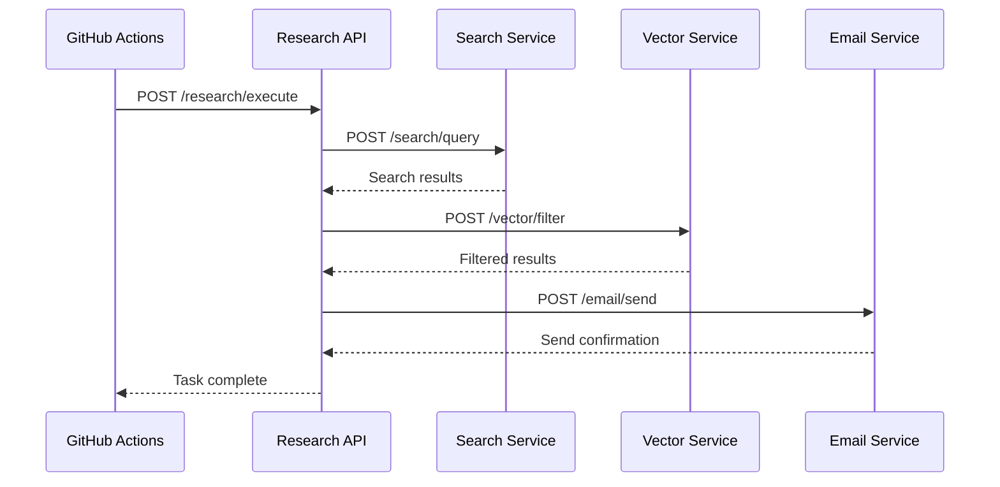

# Credit Research API Design

## 🎯 架构概览

### 微服务分层架构
```
┌─────────────────────────────────────────────┐
│                GitHub Actions               │
│                 (Workflow)                  │
└─────────────┬───────────────────────────────┘
              │ HTTP Requests
┌─────────────▼───────────────────────────────┐
│             API Gateway                     │
│              (Load Balancer)                │
└─────────────┬───────────────────────────────┘
              │
    ┌─────────┼─────────┐
    │         │         │
┌───▼──┐  ┌──▼───┐  ┌──▼────┐
│Search│  │Vector│  │ Email │
│ API  │  │ API  │  │  API  │
└──────┘  └──────┘  └───────┘
```

## 📋 API端点设计

### 1. 搜索服务 API
```http
POST /api/v1/search/query
GET  /api/v1/search/health
```

### 2. 向量服务 API  
```http
POST /api/v1/vector/embed
POST /api/v1/vector/search
POST /api/v1/vector/filter
GET  /api/v1/vector/health
```

### 3. 邮件服务 API
```http
POST /api/v1/email/send
GET  /api/v1/email/health
```

### 4. 编排服务 API (主服务)
```http
POST /api/v1/research/execute
GET  /api/v1/research/status/{task_id}
GET  /api/v1/research/health
```

## 🔗 详细API规范

### 搜索API

#### POST /api/v1/search/query
**Request:**
```json
{
    "topics": ["信用风险管理", "ESG评级"],
    "time_filter": "2024-01-01",
    "max_results": 50
}
```

**Response:**
```json
{
    "status": "success",
    "data": {
        "results": [
            {
                "title": "信用风险管理最新趋势",
                "url": "https://example.com/article1",
                "snippet": "...",
                "published_date": "2024-12-01",
                "relevance_score": 0.95
            }
        ],
        "total_count": 25
    }
}
```

### 向量API

#### POST /api/v1/vector/embed
**Request:**
```json
{
    "texts": ["文本1", "文本2"],
    "model": "qwen" // or "deepseek"
}
```

#### POST /api/v1/vector/search
**Request:**
```json
{
    "query_embedding": [0.1, 0.2, ...],
    "collection_name": "research_docs",
    "top_k": 10,
    "filter": {"date": {"$gte": "2024-01-01"}}
}
```

#### POST /api/v1/vector/filter
**Request:**
```json
{
    "documents": [
        {
            "title": "标题1",
            "content": "内容1",
            "metadata": {"source": "perplexity"}
        }
    ],
    "selection_count": 5,
    "model": "deepseek"
}
```

### 邮件API

#### POST /api/v1/email/send
**Request:**
```json
{
    "to": "user@example.com",
    "subject": "研究结果",
    "body": "...",
    "attachments": []
}
```

### 编排API

#### POST /api/v1/research/execute
**Request:**
```json
{
    "search_config": {
        "topics": ["信用风险管理"],
        "time_filter": "2024-01-01"
    },
    "filter_config": {
        "selection_count": 5,
        "model": "deepseek"
    },
    "email_config": {
        "recipients": ["user@example.com"]
    }
}
```

**Response:**
```json
{
    "status": "accepted",
    "task_id": "research_task_123",
    "message": "Research task started"
}
```

## 🛠️ 技术栈

### API服务
- **Framework**: FastAPI (Python)
- **数据库**: SQLite/PostgreSQL (任务状态)
- **向量数据库**: ChromaDB/Pinecone/Weaviate
- **消息队列**: Redis/Celery (异步任务)
- **容器**: Docker + Docker Compose

### 客户端 
- **HTTP客户端**: requests/httpx
- **配置管理**: Pydantic Settings
- **重试机制**: tenacity

## 🔄 数据流程



## 🚀 优势

1. **可扩展性**: 每个服务可独立扩展
2. **容错性**: 单个服务故障不影响整体
3. **可维护性**: 清晰的职责分离
4. **可测试性**: 独立的API端点测试
5. **多客户端支持**: Web、CLI、GitHub Actions
6. **版本控制**: API版本化管理

## 📦 部署方案

### 开发环境
```yaml
# docker-compose.dev.yml
version: '3.8'
services:
  research-api:
    build: ./api
    ports: ["8000:8000"]
  
  chromadb:
    image: chromadb/chroma
    ports: ["8001:8000"]
  
  redis:
    image: redis:alpine
    ports: ["6379:6379"]
```

### 生产环境
- **云服务**: AWS ECS/Fargate, GCP Cloud Run
- **负载均衡**: AWS ALB, Cloudflare
- **监控**: Prometheus + Grafana
- **日志**: ELK Stack